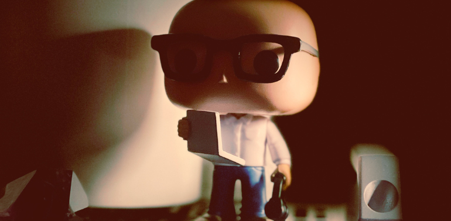

<h1 style="color: #ddc7a1;">h0me</h1>

<!-- Goals Subtitle -->

  <h3 style="color: #ddc7a1;">The goal is simple:</h3>
  

    <strong style="color: #a9b665;">1.</strong> Reproducible
    <strong style="color: #a9b665;">2.</strong> Version Controlled
    <strong style="color: #a9b665;">3.</strong> Learn Something New
  

 

<!-- Side-by-Side Dev and Prod Columns -->
<table style="width: 100%; border: none; border-collapse: collapse; text-align: center; color: #ddc7a1;">
  <thead>
    <tr style="border: none;">
      <th style="width: 50%; border: none; text-align: center; font-size: 1.5em; padding-bottom: 10px; color: #e78a4e;">Dev</th>
      <th style="width: 50%; border: none; text-align: center; font-size: 1.5em; padding-bottom: 10px; color: #e78a4e;">Prod</th>
    </tr>
  </thead>
  <tbody>
    <tr style="border: none;">
      <!-- DEV BADGES -->
      <td style="border: none; text-align: center; vertical-align: top;">
        
          
          
        

        

          
          
          
          
          
          
        

      </td>
      <!-- PROD BADGES -->
      <td style="border: none; text-align: center; vertical-align: top; padding-top: 15px;">
        <strong style="color: #d8a657;">WIP</strong>
      </td>
    </tr>
  </tbody>
</table>

<!--
Per-cluster rows: add a new "### <env> — <cluster>" block per cluster as staging
and prod come online, pointing the badges at https://<env>-kromgo.th0th.dev/<metric>.

### staging — staging

... (versions row)

... (resources row)
-->
